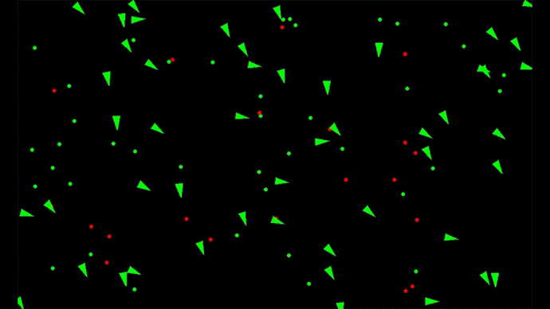

## Steering Evolutionary Vehicles using Genetic Algorithm

The vehicles that are attracted towards food (green dots) survive by replenishing their health and ones that are attracted to poison eat it and die leaving food behind. Using genetic algorithm, vehicles that survive longer evolve genetically by Darwin's Theory of Evolution.  

